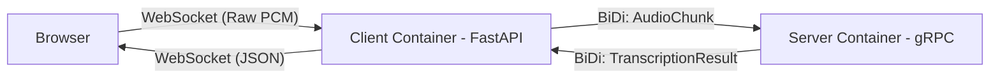

# gRPC Streaming Audio Transcription

This project demonstrates real-time audio streaming from a browser to a gRPC server for transcription (e.g., using OpenAI Whisper).

## Architecture

The system uses a WebSocket to bridge audio from the browser to a gRPC bidirectional stream on the server.




## Audio Troubleshooting Links

- [20 - 20,000 Hz Audio Sweep](https://www.youtube.com/watch?v=PAsMlDptjx8)
- [Online Tone Generator](https://onlinetonegenerator.com/)
- [Musicca Virtual Instruments](https://www.musicca.com/instruments)


## Troubleshooting Audio Input 

```bash
# update and install packages
sudo apt update
sudo apt install pavucontrol # install pavucontrol, better input and output device control
sudo apt install alsa-utils # install alsa-utils, for arecord, aplay, etc.
pavucontrol # check the input device

# check services status and restart them if needed
systemctl --user status pipewire pipewire-pulse wireplumber # check the status of the services
systemctl --user restart pipewire pipewire-pulse wireplumber # restart the services

# test recording and playing audio
arecord -l # check the input devices
arecord -d 5 -f cd -D hw:3,0 test.wav # record for 5 seconds, cd quality, using card 3 & device 0, save to test.wav
aplay test.wav # play the recorded file
```